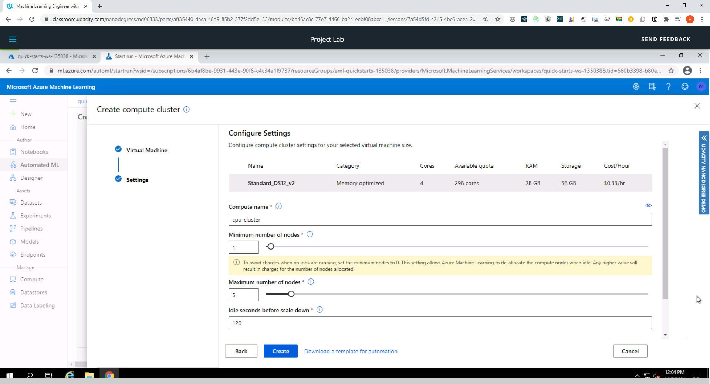
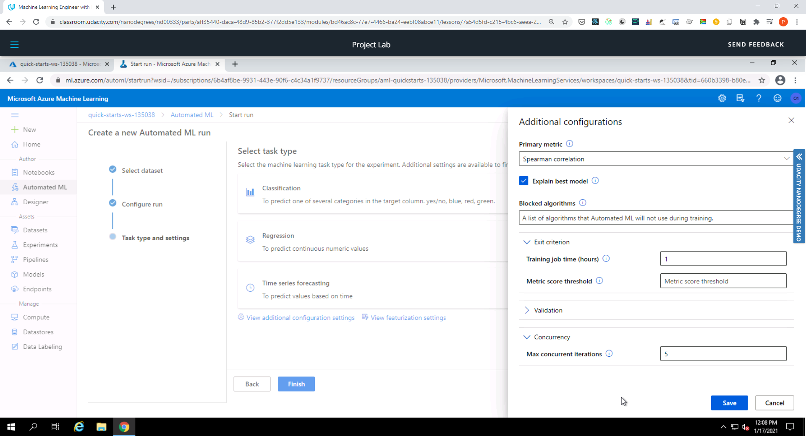

# Operationalizing Machine Learning pipeline in Azure

This project demonstrates how to use Azure to configure a cloud-based machine learning production model, deploy it, and consume it. IN addition it involves how to create, publish, and consume a pipeline.

## Architectural Diagram

1. **Authentication** : In this step, we need to create a Security Principal (SP) to interact with the Azure Workspace.
2. **Automated ML Experiment** : In this step, we create an experiment using Automated ML, configure a compute cluster, and use that cluster to run the experiment.
3. **Deploy the best model** : Deploying the Best Model will allow us to interact with the HTTP API service and interact with the model by sending data over POST requests.
4. **Enable logging** : Logging helps monitor our deployed model. It helps us know the number of requests it gets, the time each request takes, etc.
5. **Swagger Documentation** : In this step, we consume the deployed model using Swagger.
6. **Consume model endpoints** : We interact with the endpoint using some test data to get inference.
7. **Create and publish a pipeline** : In this step, we automate this workflow by creating a pipeline with the Python SDK. 

## Key Steps

### 1: Authentication
Authentication was done through the provided Udacity lab. 

### 2: Automated ML Experiment

  * Create a New Automated ML run
   
   
   
  * Select and upload the Bankmarketing dataset
   
  * Configure a new compute cluster with **Standard_DS12_v2** for the Virtual Machine Size and **1** as the number of minimum nodes.
  * Run the experiment using **Classification**, ensure **Explain best model** is checked.   On Exit criterion, reduce the default (3 hours) to 1 and reduce the             **Concurrency** from default to 5
  * Screenshot of Experiment completed
    
  * Screenshot of Best model after experiment completed
    

### 3: Deploy the best model
Select the best model for deployment Deploy the model and enable "Authentication" Deploy the model using Azure Container Instance (ACI)

### 4: Enable logging

  * Ensure az is installed, as well as the Python SDK for Azure
  * Create a new virtual environment with Python3
  * Write and run code to enable Application Insights
  * Use the provided code logs.py to view the logs
  * Screenshot of Application Insights enabled
    
  * Screenshot of Logs running
    

### 5: Swagger Documentation
  
  * Run the swagger.sh and serve.py
  * Screenshot of swagger running on localhost showing the HTTP API methods and responses for the model
    
    
    

### 6: Consume model endpoints

  * Modifying both the **scoring_uri** and the **key** to match the key for your service and the URI that was generated after deployment
  * Execute the **endpoint.py** file
    

### 7: Create and publish a pipeline

  * Upload the Jupyter Notebook **aml-pipelines-with-automated-machine-learning-step.ipynb** to the Azure ML studio
  * Update all the variables that are noted to match your environment
  * Make sure a **config.json** has been downloaded and is available in the current working directory
  * Run through the cells
  * Verify the pipeline has been created and shows in Azure ML studio, in the **Pipelines** section
  * Verify that the pipeline has been scheduled to run or is running
  * Screenshot showing that the pipeline has been created
    
  * Screenshot showing the Pipeline Endpoint
    
  * Screenshot of the Bankmarketing dataset with the AutoML module
    
  * Screenshot of the **Published Pipeline overview**, showing a REST endpoint and a status of ACTIVE
    
  * Screenshot showing that the **Use RunDetails Widget** shows the step runs
    
  * Screenshot showing the scheduled run
    
    
## Screen Recording
*TODO* Provide a link to a screen recording of the project in action. Remember that the screencast should demonstrate:
