# Operationalizing Machine Learning pipeline in Azure

This project demonstrates how to use Azure to configure a cloud-based machine learning production model, deploy it, and consume it. In addition it involves how to create, publish, and consume a pipeline.

## Architectural Diagram

1. **Authentication** : In this step, we need to create a Security Principal (SP) to interact with the Azure Workspace.
2. **Automated ML Experiment** : In this step, we create an experiment using Automated ML, configure a compute cluster, and use that cluster to run the experiment.
3. **Deploy the best model** : Deploying the Best Model will allow us to interact with the HTTP API service and interact with the model by sending data over POST requests.
4. **Enable logging** : Logging helps monitor our deployed model. It helps us know the number of requests it gets, the time each request takes, etc.
5. **Swagger Documentation** : In this step, we consume the deployed model using Swagger.
6. **Consume model endpoints** : We interact with the endpoint using some test data to get inference.
7. **Create and publish a pipeline** : In this step, we automate this workflow by creating a pipeline with the Python SDK. 

## Key Steps

### 1: Authentication
Authentication was done through the provided Udacity lab.

### 2: Automated ML Experiment

  * In this step we created a New Automated ML run by linking it to the Bank Marketing Dataset, creating a compute cluster to run it
   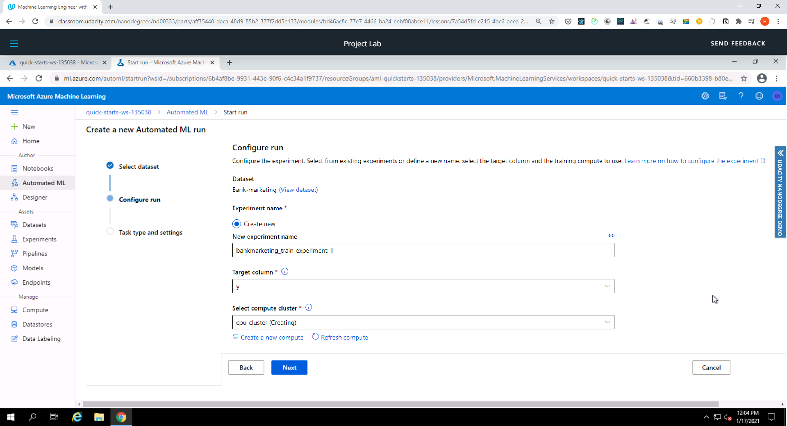
  * Select and upload the Bankmarketing dataset
   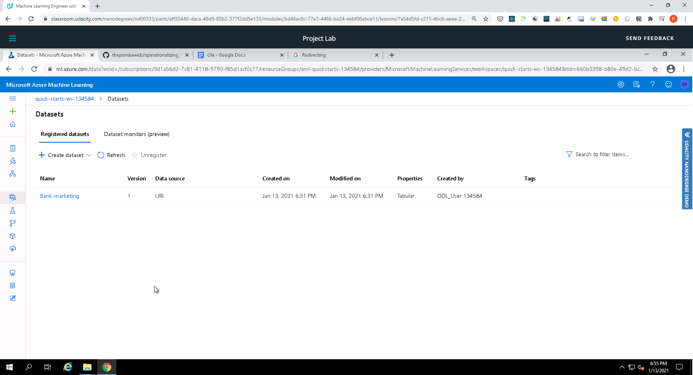
  * Configure a new compute cluster with **Standard_DS12_v2** for the Virtual Machine Size and **1** as the number of minimum nodes.
  * Run the experiment using **Classification**, ensure **Explain best model** is checked.   On Exit criterion, reduce the default (3 hours) to 1 and reduce the             **Concurrency** from default to 5
  * Screenshot of Experiment completed
    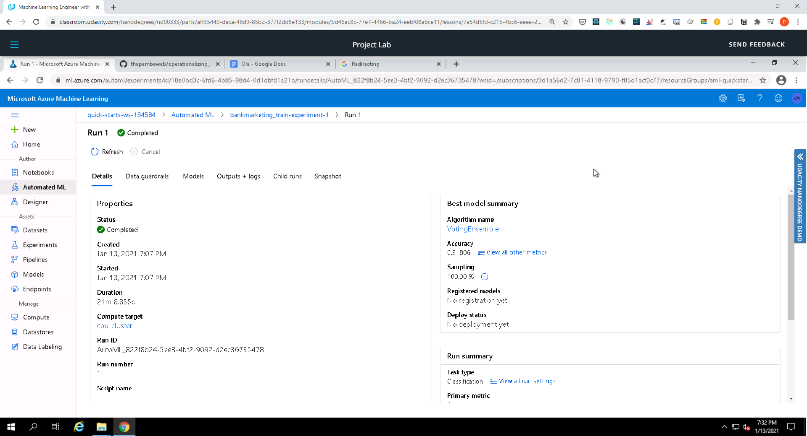
  * Screenshot of Best model after experiment completed
    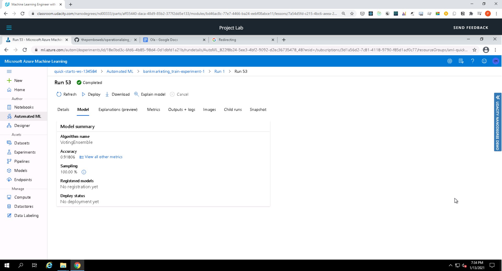

### 3: Deploy the best model

  Here we selected the best model for deployment Deploy the model and enable "Authentication" Deploy the model using Azure Container Instance (ACI)
  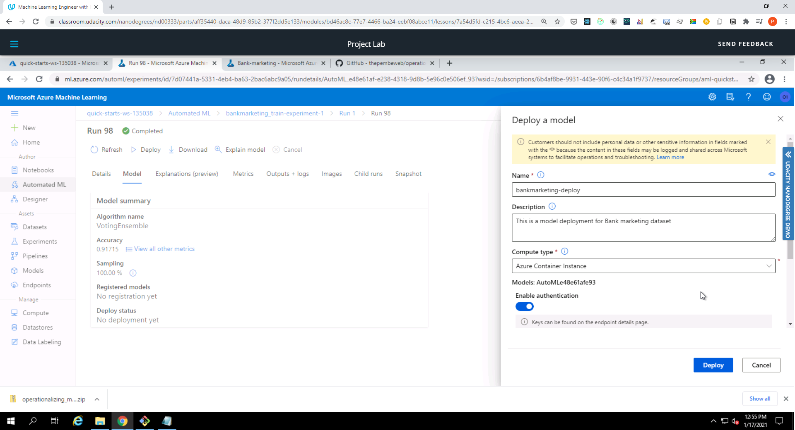
  

### 4: Enable logging

  * Here we first ensure that az is installed, as well as the Python SDK for Azure
  * Next, we create a new virtual environment with Python3
  * To allow us to view logs we have tro enable Because Application Insights. We then updated code in logs.py and ran it to enable Application Insights
  * We were able to view the logs by running 'python logs.py'
  * Screenshot of Application Insights enabled
    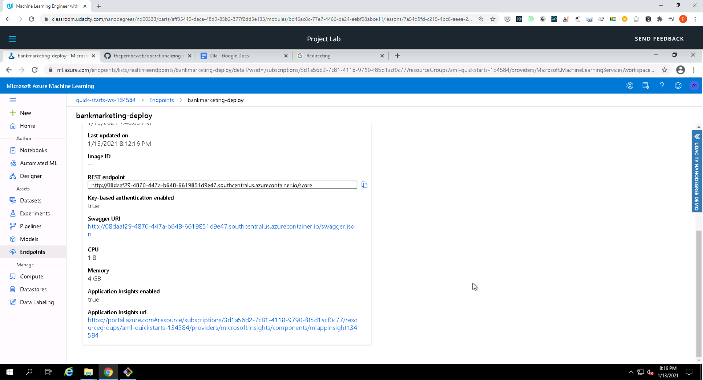
  * Screenshot of Logs running
    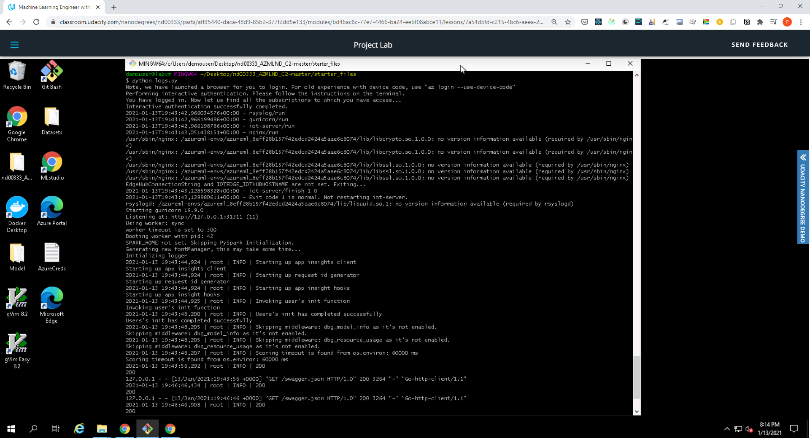

### 5: Swagger Documentation
  
  * To view swagger we then ran swagger.sh to run the swagger UI container and makes it available on port 80
  * We then run serve.py and then view the contents of the API for the model by visiting http://localhost:8000/swagger.json
  * Screenshot of swagger running on localhost showing the HTTP API methods and responses for the model
    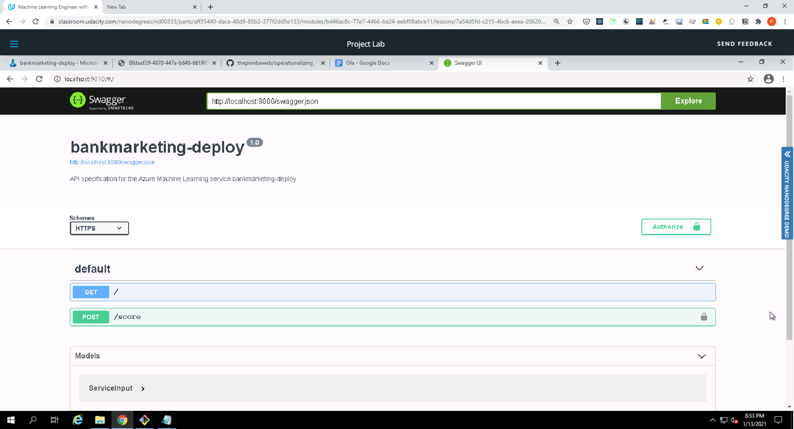
    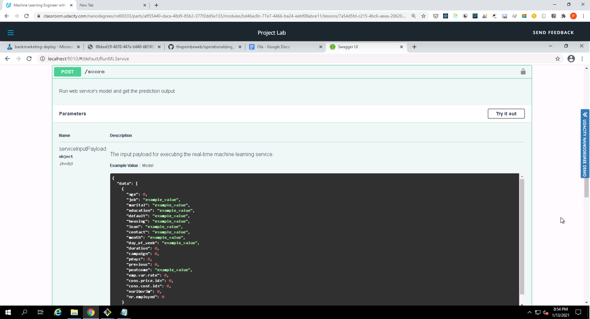
    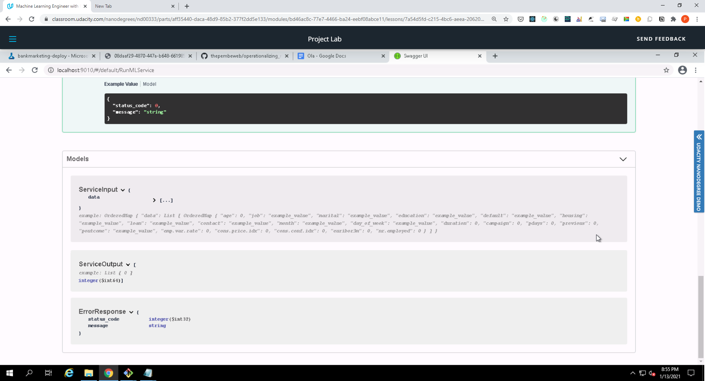

### 6: Consume model endpoints

  * Modifying both the **scoring_uri** and the **key** to match the key for your service and the URI that was generated after deployment
  * Execute the **endpoint.py** file
    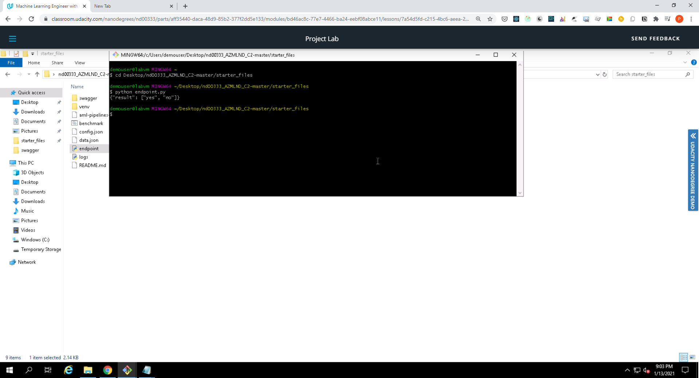

### 7: Create and publish a pipeline

  * Upload the Jupyter Notebook **aml-pipelines-with-automated-machine-learning-step.ipynb** to the Azure ML studio
  * Update all the variables that are noted to match your environment
  * Make sure a **config.json** has been downloaded and is available in the current working directory
  * Run through the cells
  * Verify the pipeline has been created and shows in Azure ML studio, in the **Pipelines** section
  * Verify that the pipeline has been scheduled to run or is running
  * Screenshot showing that the pipeline has been created
    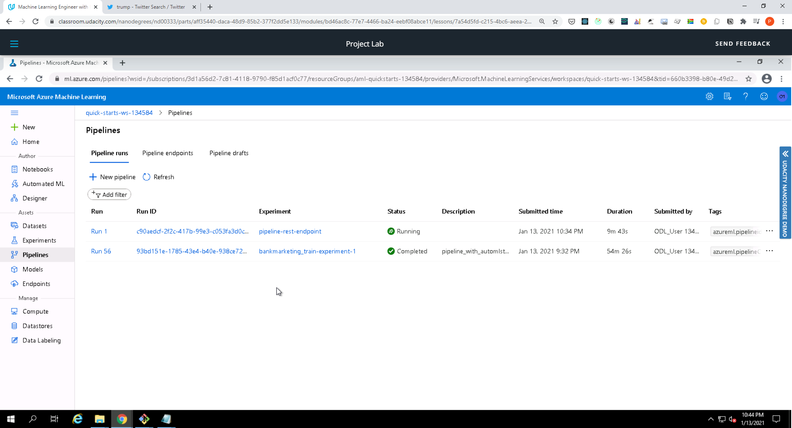
  * Screenshot showing the Pipeline Endpoint
    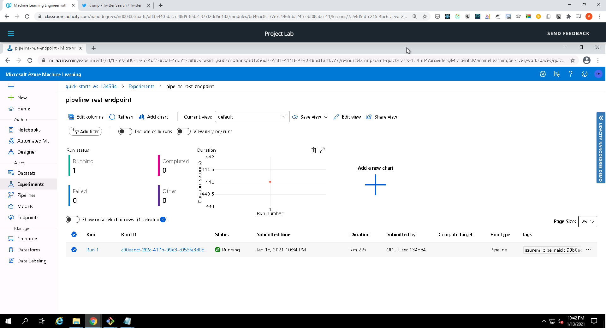
  * Screenshot of the Bankmarketing dataset with the AutoML module
    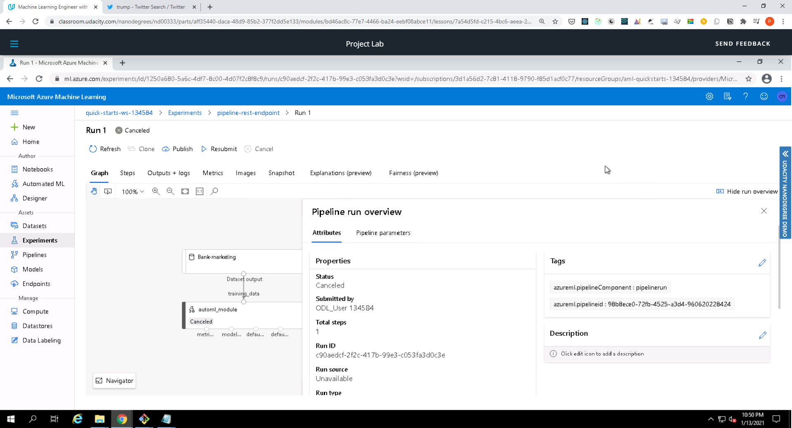
  * Screenshot of the **Published Pipeline overview**, showing a REST endpoint and a status of ACTIVE
    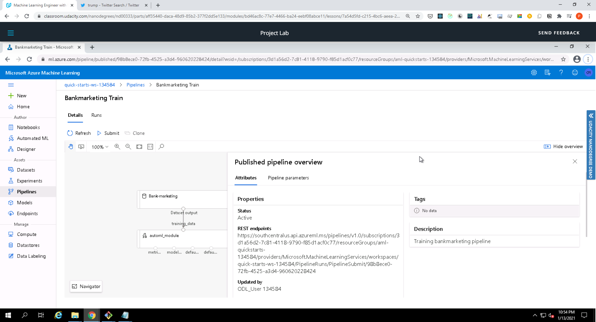
  * Screenshot showing that the **Use RunDetails Widget** shows the step runs
    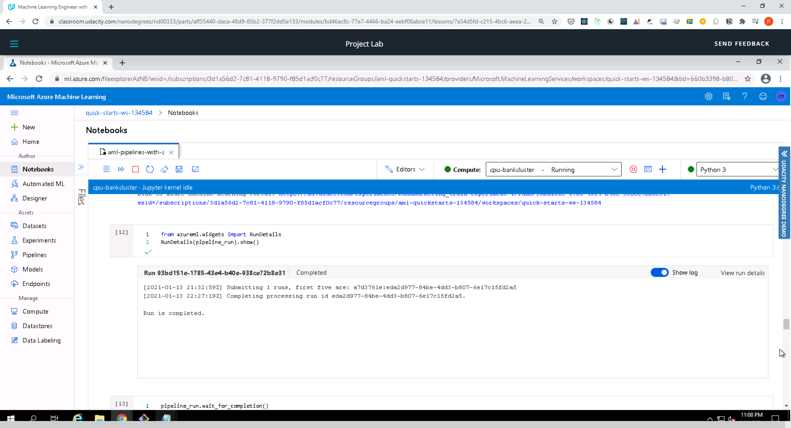
  * Screenshot showing the scheduled run
    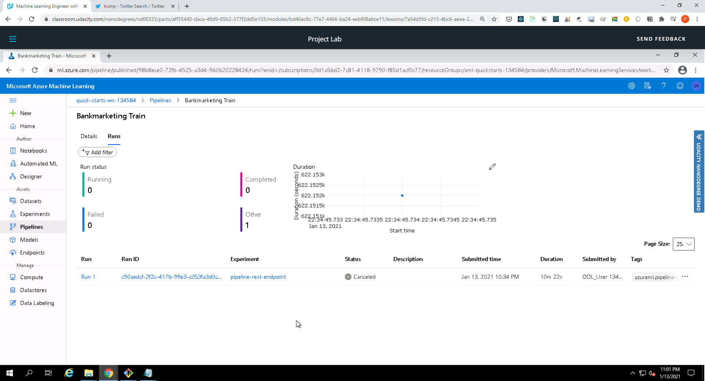

## Future work
For future experiments, we can try use more data to improve accuracy. 
We can also try different models and see if we get a better accuracy and train a more robust model for inferencing.

For AutoML, we can try implementing explicit model complexity limitations to prevent over-fitting. We can also test out different parameter values such as number of folds for Cross Validation. In addition we can try working with raw data only and passing it to AutoML to see how it handles it and if it will affect the chosen model and the model accuracy. Reducing over-fitting is an important task that may improve model accuracy. If a model is over-fitting, it might have a high accuracy with training data, but will fail when performing inferencing on test data.

## Screen Recording
[Screencast on YouTube](https://youtu.be/I1e6oXN9gXM)

## Built With

* [Azure](https://portal.azure.com/) - Cloud service provider used
* [Python](https://www.python.org/) - The programming language used
* [Bank Marketing dataset](https://automlsamplenotebookdata.blob.core.windows.net/automl-sample-notebook-data/bankmarketing_train.csv) - Dataset used

## Authors

* **[Pemberai Sweto](https://github.com/thepembeweb)** - *Initial work* - [Operationalizing Machine Learning pipeline in Azure
](https://github.com/thepembeweb/operationalizing_machine_learning_in_azure)

## License

- This project is licensed under the MIT License - see the [LICENSE](LICENSE.md) file for details
- Copyright 2020 © [Pemberai Sweto](https://github.com/thepembeweb).

